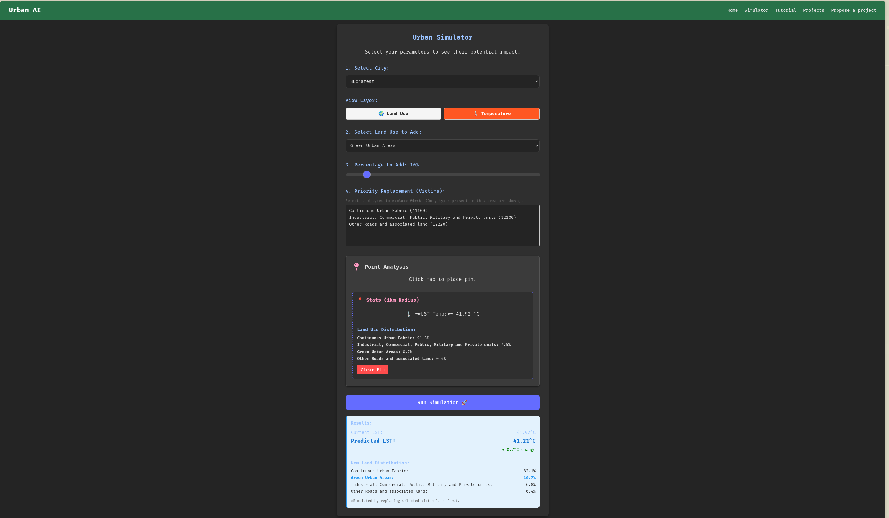
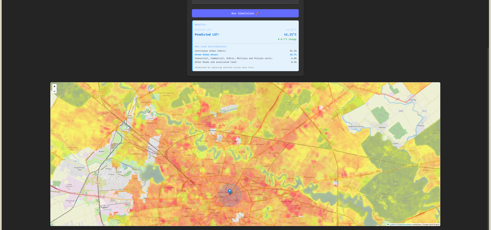

# 🌍 Urban Heat Simulator: Bucharest Case Study


## 📌 Overview
The Urban Heat Simulator is a full-stack web application designed to help visualize and predict the Urban Heat Island (UHI) effect in Bucharest. 

Instead of just looking at static temperature maps, this tool allows users to run interactive "what-if" scenarios. By changing the land-use categories of a specific area (e.g., converting roads to green spaces), the application uses a machine learning model to predict how the local temperature will change.

## 📸 Application Interface




## 🚀 How It Works (Key Features)
* **Interactive Scenario Planning:** Users can select a region and dynamically swap land-use allocations to see the predicted temperature impact.
* **Predictive ML Model:** The backend is powered by a Ridge Regression model trained on 774 data points from Bucharest, correlating 24 different land-use categories (from the Copernicus Urban Atlas) with surface temperatures.
* **Smart Priority Algorithm:** A custom logic engine that ensures user simulations respect real-world spatial constraints when replacing one land-use type with another.
* **Live Satellite Data:** Integrates with the Google Earth Engine (GEE) Python API to fetch historical Land Surface Temperature (LST) data.

## 💻 Tech Stack & Architecture

* **Frontend:** React.js (handles the interactive map, user inputs, and state management).
* **Backend:** Python / Flask (serves API endpoints and processes the simulation logic).
* **Machine Learning:** Scikit-Learn (Ridge Regression, Pandas, NumPy).
* **Geospatial Data:** Google Earth Engine API & Copernicus Urban Atlas.

## 🛠️ Local Setup & Installation

### Prerequisites
* Node.js and npm
* Python 3.x
* A Google Earth Engine account / Service Account Key

### 1. Clone the Repository
```bash
git clone [https://github.com/yourusername/urban-planning.git](https://github.com/yourusername/urban-planning.git)
cd urban-planning
